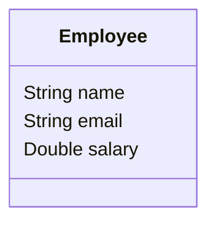

# Stream e Pipeline em Java
Exercício em Java utilizando Stream e Pipeline

Fazer um programa para ler os dados (nome, email e salário)
de funcionários a partir de um arquivo em formato .csv.
Em seguida mostrar, em ordem alfabética, o email dos
funcionários cujo salário seja superior a um dado valor
fornecido pelo usuário.
Mostrar também a soma dos salários dos funcionários cujo
nome começa com a letra 'M'.

